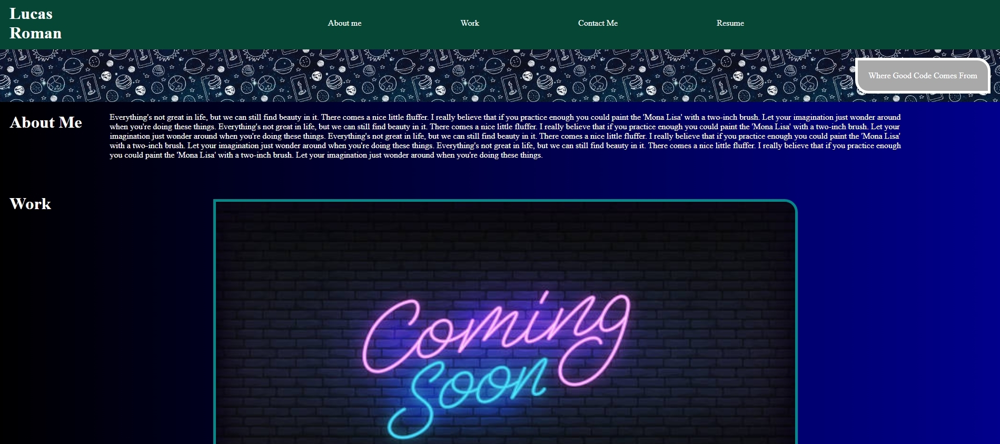

# My Portfolio

I wanted to do my best in meeting the acceptance criteria. NOT for grade sake but for my own gauge of ability. I typed out every line of code instad of copy pasting because I am new to coding and I want to develop those skills and best practices.

This project does a few things. It shows how far I've come since starting coding last week. It is a foundational site and tool to serve as a repository of my current and future work. Something I can continue to build on and grow with. 

I learned how to set up flex box nesting properly in html and defining those attribute in css. I also learned that media queries are harder than they look. I learned how to link items in page with anchors.  I learned I need to come up with better naming conventions. 


## Installation

No installation necessary. Simple html website. 

## Usage 

Shows my work and contact information in one location. 

## mock up links

```md


```

## Collaborators

none offically but a huge shoutout to the study group for help when I get stuck. 

## Tutorials and Resources used
    -w3schools
    -webMD
    -flexfroggy
    -css-tricks: a complete guide to flexbox
    