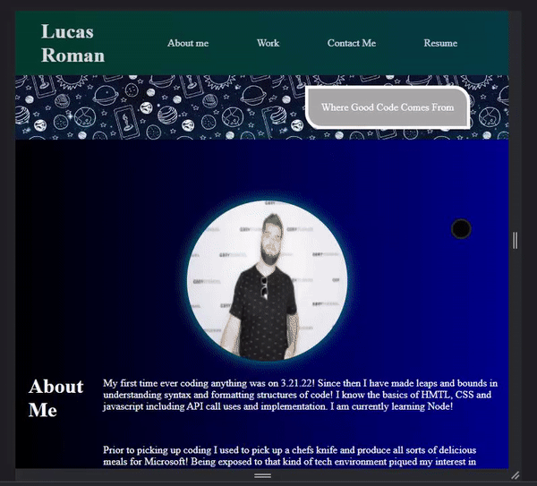
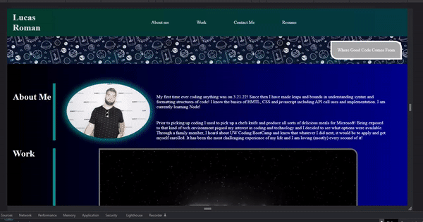

# My Portfolio

This project does a few things. It shows how far I've come since starting coding. It is a foundational site and tool to serve as a repository of my current and future work. Something I can continue to build on and grow with. 

I learned how to set up flex box nesting properly in html and defining those attribute in css. I also learned that media queries are harder than they look. I learned how to link items in page with anchors. 

## Installation

No installation necessary. Simple html website. 

## Usage 

Shows my work and contact information in one location. 

## mock up links

## Tutorials and Resources used
    -w3schools
    -webMD
    -flexfroggy
    -css-tricks: a complete guide to flexbox
    